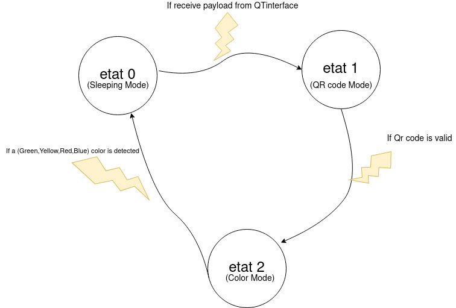

# An Amazon En Mieux Scanner    🔍
### A Python3 🐍 &OpenCv app 


# *The Goal :*
The main goal to this app is to responde to the following situation : 
*"When a signal is received from a topic, you have to wait to scan a signal corresponding QrCode, and if it is correct , you must send a signal in response"*

# 0/ Preliminaries
Let's understand the first lines , the paramaters , each one of them are explained with a comment 
```python
id_camera = 3  # = Group Number
broker = 'mqtt-milles.imerir.org'
port = 1883  # = Broker port
ID_ROBOT = "ROBOT3"  # = ID of the Robot
topic_to_write = "field/camera/{}/color".format(id_camera)
topic_to_listen = "field/camera/3/scan"
username = "terrain1"
password = "w87KNd2b"

Signal_recu = None  # Global var used to store the
rayon_perce = 90    #minimum size to detect
lum = 30 #parameter to handle luminosity
```
#  Understand the functionment 

First lets see the **MQTT part :** 
```python
# The callback for when the client receives a CONNACK response from the server.
def on_connect(client, userdata, flags, rc):
    print("Connected with result code " + str(rc))

    # Subscribing in on_connect() means that if we lose the connection and
    # reconnect then subscriptions will be renewed.
    client.subscribe(topic_to_listen)


# The callback for when a PUBLISH message is received from the server.
def on_message(client, userdata, msg):
    etat = 0
    x = json.loads(msg.payload)
    global Signal_recu
    Signal_recu = x
    x = json.loads(msg.payload)
    # If we receive a payload from the topic
    if Signal_recu is not None:
        print("received: ", x, "from:{}".format(topic_to_listen))
        # Checking if the payload , converted as a Json corresponds
        if 'robot' in Signal_recu.keys() and Signal_recu['robot'] == ID_ROBOT:
            etat = 1
            # Moving to etat = 1 , the system is no longer sleeping , and is prepared to scan the QR Code
    if etat == 0:
        pass
    if etat == 1:
        run(etat)


client = mqtt.Client()
client.on_connect = on_connect
client.username_pw_set(username, password)
client.on_message = on_message
client.connect(broker, 1883)
client.loop_forever()
```
Will listen to the *topic_to_listen* and convert the payload to a Json , this Json will be stored into Signal_recu var and will also be printed


## **Main function**
```python
run()
```
*You may understand the entire code by reading the comments*
As long as we dont receive the starting signal from the Qt Interface we are at *etat=0* 
When the mesasge is received from the *topic_to_listen* and the payload corresponds exactly to what payload is expected to be , we move to *etat=1*
There we are waiting for scannign the Qr Code , as long as the QrCode scanned is not corresponding to the *ID_ROBOT* we stay at *etat=1*
**How is the QR scanner working ?** :
```python 
qr_decoder = cv2.QRCodeDetector()
data, bbox, rectified_image = qr_decoder.detectAndDecode(frame)
```
This 2 lignes use the cv2 library ,methods and abe us to get the corresponding data of the QRCode , this is stored into the *data* var

If the QrCode (=data) is corresponding to our Robot (this means that we only care about our robot) we proceed to the color detection(*etat=2*)
**How is the color scanner working ?** :
First we convert the image to HSV  
```python 
hsvFrame = cv2.cvtColor(imageFrame, cv2.COLOR_BGR2HSV)
```
Then , we define a mask to apply on every color , values are taken from common mask used in OpenCv , they have been changed many times to correspodns exactly to the configuration where the demonstration has to take place . 
```python
        red_lower = np.array([136, 87, 111], np.uint8)
        red_upper = np.array([180, 255, 255], np.uint8)
        red_mask = cv2.inRange(hsvFrame, red_lower, red_upper)

        # Set range for green color and
        # define mask
        green_lower = np.array([40, 40+lum, 40], np.uint8)
        green_upper = np.array([70, 255, 255], np.uint8)
        green_mask = cv2.inRange(hsvFrame, green_lower, green_upper)

        # Set range for blue color and
        # define mask
        blue_lower = np.array([100, 150+lum, 0], np.uint8)
        blue_upper = np.array([138, 255, 255], np.uint8)
        blue_mask = cv2.inRange(hsvFrame, blue_lower, blue_upper)

        # Set range for yellow color and
        # define mask
        yellow_lower = np.array([22, 93, 0], np.uint8)
        yellow_upper = np.array([45, 255, 255], np.uint8)
        yellow_mask = cv2.inRange(hsvFrame, yellow_lower, yellow_upper)
```
Then we dilate the image using this kernal (taken from OpenCv documentation) for each color
Finally : 
```python
# Creating contour to track red color
        contours, hierarchy = cv2.findContours(red_mask,
                                               cv2.RETR_TREE,
                                               cv2.CHAIN_APPROX_SIMPLE)
        # Track red color
        for pic, contour in enumerate(contours):
            area = cv2.contourArea(contour)
            if (area > 300):
                x, y, w, h = cv2.boundingRect(contour)
                # Detect red if only size of w and h > 50
                if w > rayon_perce and h > rayon_perce:
                    imageFrame = cv2.rectangle(imageFrame, (x, y),
                                               (x + w, y + h),
                                               (0, 0, 255), 2)
                    # Display a red text to inform about red color
                    cv2.putText(imageFrame, "Red Colour", (x, y),
                                cv2.FONT_HERSHEY_SIMPLEX, 1.0,
                                (0, 0, 255))
                    # Publishing response as  a Json to the topic
                    data_set = {"robot": data, "color": "red"}
                    json_dump = json.dumps(data_set)
                    result = client.publish(topic_to_write, json_dump)
                    status = result[0]
                    if status == 0:
                        print("Send {}to topic {}".format(json_dump,topic_to_write))
                        # Going back to etat 0 awaiting a new order
                        etat = 0

                    else:
                        print(" Failed to end {}to topic {}".format(json_dump,topic_to_write))
```
For each color we find the contours ,using openCv methode ( and documentation) 
If the are and the size of the detected color are large enaught we  put a text if the color is detected this avoid noîse and some color detection issues.

**Once detected** we publish a JSON to the corresponding topic alerting the QT supervisor to what has been snapshooted by the camera . And we go back to *etat=0* awaiting a new signal from the QT supervisor . 

###### *@author : gauthier bzizarri*