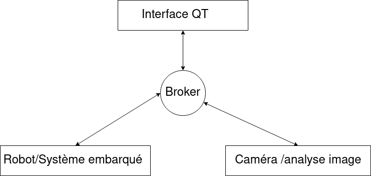

# Projet d'intégration -Déplacement d'un robot porteur de colis dans un entrepot 📦

L'objectif de ce projet est de créer/concevoir une solution permettant d'acheminer un colis à sa zone de dépot . La livraison doit  :

- Passer devant un scanner validant le processus
- - avec rapidité
- - avec traçabilité
- Effectuer le trajet 
- - avec rapidité 
- - avec traçabilité

Le plan de l’entrepot est représenté dans le dessin ci-dessous. 

- Les chemins empruntables sont matérialisés par des bandes au sol
- Les robots ne peuvent les emprunter que dans le sens indiqués par les flèches (afin d’éviter de la collision entre les robots)

##  Notre équipe

Nous sommes une équipe de 4  étudiants en formation au sein de l’IMERIR de Perpignan (66000). L’IMERIR est une école supérieure préparant aux métiers de la Robotique, de l’Intelligence Artificielle, de la Cybersécurité, du Numérique, de l’Internet des Objets, ainsi qu’à d’autres métiers du numérique de demain.

Liste des membres : 

- BOYER Florian (Scrum master / Dév)
- BIZZARRI GAUTHIER (Dév)
- BOURROUX Florian (Product owner / Dév)
- BONNAUD Théo (Dév)

**Attributions aux différents pôles** :

---

Pôle Robot :  BOURROUX BONNAUD

---

Pôle Analyse image : BIZZARRI

---

Pôle Interface QT : BOYER

---

## Environnement 

Le plan de l'entrepot est représenté par une piste imprimée sur papier. 

## Architecture

Le schéma suivant illustre l'architecture globale de la solution à déployer :

Robots et Superviseurs utilisent les fonctionnalités du Service Web pour communiquer entre eux (consignes, résultats, etc).

## Back-log 📄
- En tant qu'utilisateur , je veux pouvoir demander a mon robot d'aller chercher un colis.
- En tant qu'application , je veux pouvoir optimiser les ordres envoyés.
- En tant qu'utilisateur, je veux pouvoir voir l'état des robots.
- En tant qu'utilisateur , je veux pouvoir analyser mon Qr code .
- En tant qu'utilisateur , je souhaite savoir si mon colis est valide .
- En tant qu'utilsiateur , je souhaite que le robot s'arrète pendant le chargement.
- En tant qu'utilisateur , je souhaite que le robot suive des règles de déplacement.
- En tant qu'uilisateur , je veux que le robot attende sous le lecteur QR.
- En tant qu'utilisateur , je veux savoir si mon colis est valide.
- En tant qu'utilisateur , je veux pouvoir optimiser les ordres envoyés
